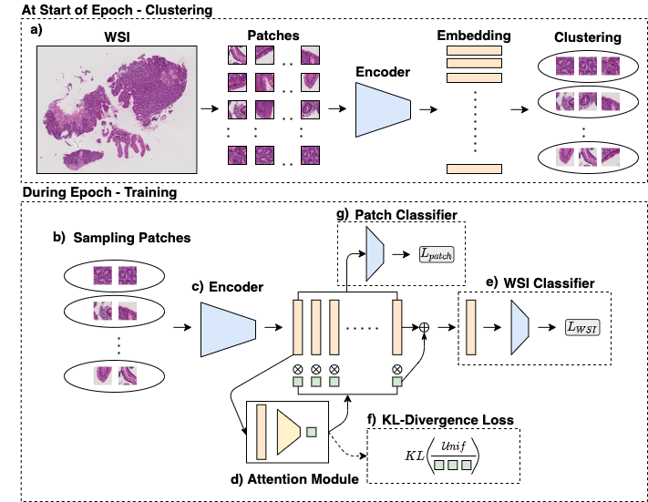

# C2C

## Introduction

Implementation of Cluster-to-Conquer: A Framework for End-to-End Multi-Instance Learning for Whole Slide Image Classification approach. In this work, we propose an end-to-end framework with following features:
- Cluster-based sampling for diverse patch selection from a WSI
- Attention-based aggregation for slide-level prediction
- Inclusion of KL-divergence in the loss for regularizing the intra-cluster variance
    
<p align="center">
    
</p>    
    
## Abstract

In recent years, the availability of digitized Whole Slide Images (WSIs) has enabled the use of deep learning-based computer vision techniques for automated disease diagnosis. However, WSIs present unique computational and algorithmic challenges. WSIs are gigapixel-sized (~100K pixels), making them infeasible to be used directly for training deep neural networks. Also, often only slide-level labels are available for training as detailed annotations are tedious and can be time-consuming for experts. Approaches using multiple-instance learning (MIL) frameworks have been shown to overcome these challenges. Current state-of-the-art approaches divide the learning framework into two decoupled parts: a convolutional neural network (CNN) for encoding the patches followed by an independent aggregation approach for slide-level prediction. In this approach, the aggregation step has no bearing on the representations learned by the CNN encoder. We have proposed an end-to-end framework that clusters the patches from a WSI into k-groups, samples k' patches from each group for training, and uses an adaptive attention mechanism for slide level prediction; Cluster-to-Conquer (C2C). We have demonstrated that dividing a WSI into clusters can improve the model training by exposing it to diverse discriminative features extracted from the patches. We regularized the clustering mechanism by introducing a KL-divergence loss between the attention weights of patches in a cluster and the uniform distribution. The framework is optimized end-to-end on slide-level cross-entropy, patch-level cross-entropy, and KL-divergence loss. 

## Installation

## How to Use

The main funciton requires an input file containing a csv file with following columns:
- path - location of patches
- wsi - unique identifier corresponding to each patch
- label - binary label (0 or 1)
- is_valid - if wsi is part of validation split

### Jupyter Notebook Option

### Python Option

## Directory Set-Up

```bash
C2C/
   ├── models
         ├─── resnet.py
   ├── dataloader.py
   ├── train.py
   ├── cluster.py
   ├── loss.py
   ├── eval_model.py
   ├── utils.py

```
